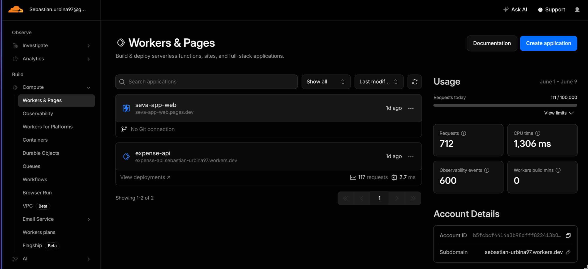

# Mi app de finanzas personales

Quiero compartir mi experiencia acerca de **cómo construí mi actual aplicación de finanzas y control de gastos personales**.

## El comienzo (o eso creo)

Cuando inicié este camino, estaba aprendiendo muchísimo sobre **arquitectura de software**, **patrones de diseño**, **AWS** y **FastAPI**. 
Impulsado por el entusiasmo, decidí construir una aplicación **Full-Stack**: el clásico **dashboard** interactivo para visualizar todos mis gastos, ingresos y transacciones personales.

Para ello, creé este [repositorio](https://github.com/SebasUrbina/finapp-web), donde comencé a estructurar la API con **FastAPI** utilizando la siguiente arquitectura:

| Name | Last commit message | Last commit date |
| :--- | :--- | :--- |
| `..` | | |
| `📁 api/routes` | ♻️ refactor: reorganize auth backend and reorder code | 8 months ago |
| `📁 auth` | ♻️ refactor: reorganize auth backend and reorder code | 8 months ago |
| `📁 core` | 🚧 first commit. WIP | 9 months ago |
| `📁 dependencies` | ♻️ refactor: reorganize auth backend and reorder code | 8 months ago |
| `📁 helpers` | 🚧 first commit. WIP | 9 months ago |
| `📁 middleware` | 🚧 first commit. WIP | 9 months ago |
| `📁 models` | 🚧 first commit. WIP | 9 months ago |
| `📁 schemas` | 🚧 first commit. WIP | 9 months ago |
| `📁 services` | 🚧 first commit. WIP | 9 months ago |
| `📄 __main__.py` | 🔧feat: base files to fastapi app | 9 months ago |
| `📄 application.py` | 🚧 first commit. WIP | 9 months ago |
| `📄 lifespan.py` | 🚧 first commit. WIP | 9 months ago |
| `📄 logging.py` | 🚧 first commit. WIP | 9 months ago |

## ¿Mejor algo más simple?

Pero, como se imaginarán, dada la complejidad que conllevaba, terminé dejando el proyecto de lado. Me di cuenta de que mantener una solución de ese estilo requeriría un **servicio de hosting** para alojar la aplicación, gestionar una **base de datos** y, en ese momento, no estaba dispuesto a invertir dinero en infraestructura (además de que suelo ser bastante disperso).

Tras pausar ese desarrollo —lo cual no habla muy bien de mi constancia al principio— y aprovechando que estaba aprendiendo y utilizando **AWS** en mi trabajo de aquel entonces, decidí buscar una alternativa mucho más sencilla y práctica. 

En esa época, manejaba mis finanzas en un clásico **Excel** y justo acababa de comprarme un **iPhone**. Fue ahí donde descubrí la fantástica funcionalidad de los **iOS Shortcuts** (Atajos de iOS), que básicamente te permiten crear automatizaciones dentro del sistema. Como tenía mi tarjeta de crédito configurada en la **Apple Wallet** y la usaba para absolutamente todo, se me encendió la ampolleta: *¿Y si cada vez que pago con el teléfono, se genera una automatización que registre ese movimiento en algún lugar?*

Tras un poco de investigación, descubrí que era totalmente viable: la app de Atajos permite realizar **peticiones HTTP (API requests)** de manera automática al detectar ciertos eventos, como realizar un pago con la wallet.

Así fue como se me ocurrió diseñar una solución integrada: crearía una **API** utilizando **AWS Lambda**, el servicio **Serverless** de Amazon Web Services. Este servicio es fantástico; en términos simples, te permite ejecutar funciones en la nube sin preocuparte de configurar ni mantener servidores. Solo te enfocas en el código.

El siguiente paso era definir el almacenamiento: *¿Dónde guardaría los datos?* 

Aunque estaba acostumbrado al "maravilloso" Excel, decidí migrar mi información a **Google Sheets** para facilitar la integración. Lo mejor del ecosistema de Google es que está completamente *apificado*. Creé un proyecto en **Google Cloud Console** para habilitar la **API de Google Sheets**. ¿Para qué? Para autorizar a mi función de **AWS Lambda** a realizar peticiones de escritura e insertar nuevas filas con cada gasto detectado.

Con esto resuelto, escribí un script de código súper sencillo que pueden revisar en el siguiente [enlace al repositorio](https://github.com/SebasUrbina/serverless-expense-api/tree/feat/aws-lambda).

Una **función Lambda** solo requiere de la lógica que vive dentro de una función de **Python** (sí, literalmente así de simple). El archivo `.py` del repositorio se conecta de forma directa con la **API de Google Sheets** y registra una fila por cada ejecución.

## El atajo de iOS

> 📸 *[Aquí irá una captura de pantalla del iOS Shortcut configurado]*

Tras implementar la función de AWS Lambda, el siguiente paso era exponerla a internet para poder invocarla. Para esto, utilicé **AWS API Gateway**, un servicio que te proporciona un **endpoint HTTP** público listo para recibir peticiones desde cualquier rincón del mundo.

Para ser honesto, en esa etapa de experimentación no me preocupé demasiado por la seguridad: dejé la API totalmente abierta. Al fin y al cabo, el endpoint generado por AWS era una URL larga, compleja y muy poco amigable, por lo que era sumamente difícil que alguien la descubriera por casualidad.

Con la API pública lista, diseñé un **iOS Shortcut** en mi iPhone vinculado directamente a mi **Apple Wallet**. De este modo, cada transacción realizada con mi tarjeta desencadenaba automáticamente una petición HTTP a la API y, en cuestión de segundos, se insertaba una fila en mi **Google Sheets**.

## ¿Y si lo hacemos mejor?

Luego de unos meses utilizando con orgullo mi solución original (que era súper simple pero muy práctica), descubrí los famosos **Cloudflare Workers**. Son el equivalente de Cloudflare a las funciones **AWS Lambda**, ¡pero con un giro fantástico!

Al investigar más sobre el ecosistema de **Cloudflare** y sus servicios, me enamoré de lo bien documentados, sencillos y rápidos que son. 

A diferencia de las arquitecturas serverless tradicionales que levantan contenedores pesados (lo que suele causar los molestos *cold starts* o demoras en la primera petición), los **Cloudflare Workers** se ejecutan directamente sobre la red global de Cloudflare (*edge computing*) utilizando el motor V8 de Google Chrome. Esto significa que tu código corre en milisegundos en el punto geográfico más cercano a tu usuario, sin que tengas que preocuparte de la infraestructura ni del hardware subyacente.

Su panel de control es sumamente intuitivo, tal como se puede apreciar en la siguiente captura:

### La magia de la base de datos y la capa gratuita

Lo que realmente me voló la cabeza fue descubrir que Cloudflare no solo ofrece cómputo en el edge, sino también una suite de almacenamiento moderna y ágil:
*   **Cloudflare D1**: Su base de datos SQL serverless nativa construida sobre **SQLite**. Ofrece un rendimiento increíble y latencias mínimas al estar distribuida cerca de tus workers.
*   **Cloudflare KV**: Un almacenamiento clave-valor ultra veloz, ideal para lecturas globales instantáneas.
*   **Cloudflare Pages**: Una plataforma magnífica para alojar y desplegar aplicaciones frontend (como React, Vue, Svelte o sitios estáticos) de manera automatizada a partir de tus repositorios de GitHub.

Y lo más espectacular de todo: **¡sus servicios tienen una capa gratuita sumamente holgada!** Así que pensé de inmediato (*al tiro*) si usar todo esto me traería algún costo mensual, y la respuesta fue rotunda: *it's free* (para uso personal).

## El estado actual de la App: Seva

Así fue como mi proyecto original evolucionó a lo que es hoy: **[serverless-expense-api](https://github.com/SebasUrbina/serverless-expense-api/tree/main)**. 

Le llamo *serverless* porque me olvidé por completo de la administración de infraestructura. Gracias a los servicios de Cloudflare, cuento con un backend increíble, seguro y público, que ejecuta toda mi lógica de negocio sin pagar un solo peso.

Pucha, ya me cansé por ahora de escribir, pero les dejo el repositorio para que lo revisen con calma. Solo les alcancé a comentar sobre el backend en Cloudflare a grandes rasgos, pero el proyecto también incluye un frontend completo. Y sí (aunque no me lo crean), ¡todo está desplegado en Cloudflare de manera 100% GRATUITA!

Ahondaré más adelante en todos los detalles técnicos del desarrollo, pero por ahora ya es un producto funcional. Si quieren probarlo o usarlo para su propio control de gastos, pueden ingresar directamente a **[Seva](https://seva-app-web.pages.dev/)**.
